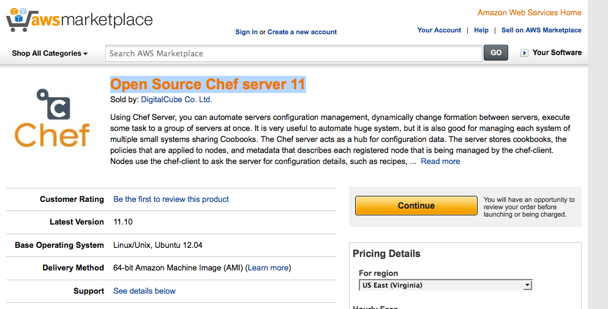
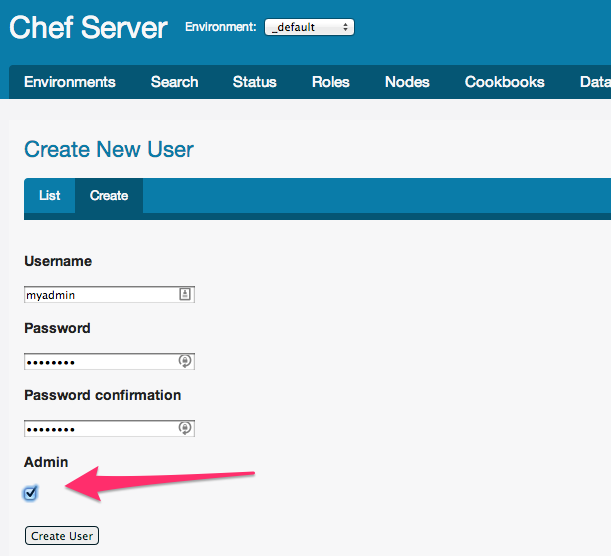

# ChefによるさくらのクラウドでMongoDBクラスタデモ

## 質問等

このリポジトリのIssueやTwitter等でお気軽にどうぞ。 

- https://github.com/higanworks/xegg2_chef/issues
- https://twitter.com/sawanoboly

## 事前準備

このリポジトリをローカルにクローンしましょう。

### 1. Chef-Serverを用意します

AWS MarketPlaceでOK

[Open Source Chef server 11](https://aws.amazon.com/marketplace/pp/B00HUHTZFM)




### 2. Adminのユーザを作成します



秘密鍵は`./chef/client/鍵の名前`におきましょう。

### 3. validation鍵をゲットしましょう

Chef-Server上の`/etc/chef-server/chef-validator.pem` を`./chef/client/chef-validator.pem`にSCPでもってきましょう。

### 4. 環境変数をセットしよう

`env.sh.sample`を`env.sh` としてコピーして、必要事項を埋めましょう。

```
export CHEF_SERVER_URL='YOUR_CHEF_SERVER_URL'
export CHEF_USER_NAME='USER_NAME'  ## Chef管理ユーザ
export CHEF_USER_KEY_PATH='PATH_TO_PEM'  ## フルパス

export SAKURACLOUD_API_TOKEN='REPLACE_TO_YOUR_TOKEN'
export SAKURACLOUD_API_TOKEN_SECRET='REPLACE_TO_YOUR_TOKEN_SECRET'
export SAKURACLOUD_USER_KEY_ID='REPLACE_TO_YOUR_KEY_ID' ## さくらのクラウドの秘密鍵ID
```

できたら読み込みます。

`source env.sh`


### 6. Gemをインストールしよう

`bundle --deployment`

### 5. CookbookをChef-Serverにアップロードしよう

`librarian-chef install`
`knife upload cookbooks/*`

## 構築

Rakeのタスクにしました。

### シングルMongDBノードを作成

`rake single[hogehoge]`

- さくらのクラウドにサーバを作成
- mongodbインストール

### レプリカセット(３台構成)MongDBノードを作成

`rake replica[piyopiyo]`

- さくらのクラウドにサーバを作成を３回
- mongodbインストールを３回
- それらでmongodbのレプリカセットを作成する
- `[]`内はレプリカセットのグループ名なので任意です。

#### セットサンプル

```
rs_default:PRIMARY> rs.config()
{
	"_id" : "rs_default",
	"version" : 1,
	"members" : [
		{
			"_id" : 0,
			"host" : "133.242.233.223:27017"
		},
		{
			"_id" : 1,
			"host" : "133.242.233.250:27017"
		},
		{
			"_id" : 2,
			"host" : "133.242.233.203:27017"
		}
	]
}
```

※数が足りなかったら`rake update[piyopiyo]` を実行すれば揃います。

#### ノードを追加する

`knife sakura create`コマンドでNodeを作成すればレプリカセットに参加します。

```
$ knife sakura create -E piyopiyo -r 'role[piyopiyo]'
```

※`piyopiyo`は参加したいグループ名。

## 後片付け

`rake sakura:destroy_all` # サーバとディスクを全部消します  
`rake cleanup`  #Chef-Serverの一時情報をクリアします